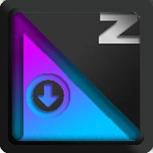
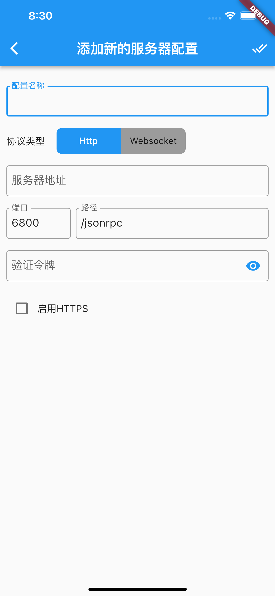

# AriaZ

## 跨平台Aria2客户端，支持安卓，ios平台，使用 框架编写;

 

 
  
 

简体中文 | [English](./README.md)

## 功能截图

&nbsp;

&nbsp;

&nbsp;

## 更新日志
### v0.0.1
- 添加aria2服务器连接;
- 添加下载任务，支持种子下载，磁力链下载，metalink下载，url（http,https,ftp,sftp等）;
- 自定义任务配置，包括下载目录，限速，覆盖下载;
- 任务暂停，启动，删除等功能;
- aria2全局配置，包括全局限速设置，默认下载地址，最多同时下载数，断点续传等;
- app多语言支持
- app主体色配置
- aria2刷新频率配置